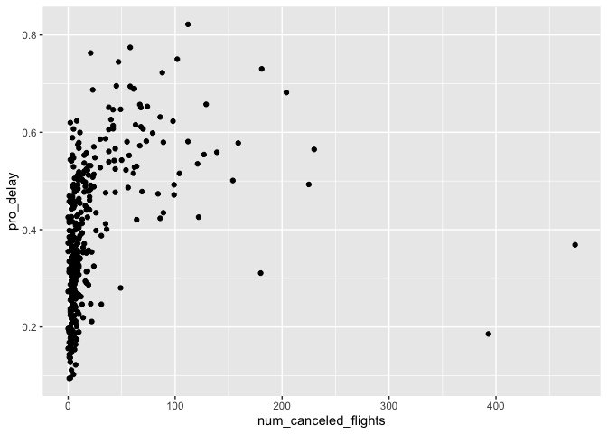

week3\_433
================
Duohan Zhang
9/28/2021

## github: <https://github.com/duohan0520/stat_433_week3>

``` r
library(nycflights13)
```

    ## Warning: package 'nycflights13' was built under R version 4.0.2

``` r
library(tidyverse)
```

    ## Warning: package 'tidyverse' was built under R version 4.0.2

    ## ── Attaching packages ─────────────────────────────────────── tidyverse 1.3.1 ──

    ## ✓ ggplot2 3.3.5     ✓ purrr   0.3.4
    ## ✓ tibble  3.1.4     ✓ dplyr   1.0.5
    ## ✓ tidyr   1.1.3     ✓ stringr 1.4.0
    ## ✓ readr   2.0.1     ✓ forcats 0.5.1

    ## Warning: package 'ggplot2' was built under R version 4.0.2

    ## Warning: package 'tibble' was built under R version 4.0.2

    ## Warning: package 'tidyr' was built under R version 4.0.2

    ## Warning: package 'readr' was built under R version 4.0.2

    ## Warning: package 'purrr' was built under R version 4.0.2

    ## Warning: package 'dplyr' was built under R version 4.0.2

    ## Warning: package 'stringr' was built under R version 4.0.2

    ## Warning: package 'forcats' was built under R version 4.0.2

    ## ── Conflicts ────────────────────────────────────────── tidyverse_conflicts() ──
    ## x dplyr::filter() masks stats::filter()
    ## x dplyr::lag()    masks stats::lag()

1.  How many flights have a missing dep\_time? What other variables are
    missing? What might these rows represent?

``` r
sum( is.na(flights["dep_time"]))
```

    ## [1] 8255

``` r
sum( is.na(flights["arr_delay"]))
```

    ## [1] 9430

``` r
sum( is.na(flights["tailnum"]))
```

    ## [1] 2512

``` r
sum( is.na(flights["air_time"]))
```

    ## [1] 9430

Other variables including arr\_delay, tail\_num and air\_time have
missing values. For missing dep\_time, they may represent canceled
flights. For missing arr\_delay and air\_time, they may represent
canceled flights and departured flights that are unable to complete the
flights.

2.  Currently dep\_time and sched\_dep\_time are convenient to look at,
    but hard to compute with because they’re not really continuous
    numbers. Convert them to a more convenient representation of number
    of minutes since midnight.

``` r
flights_new = mutate(flights, dep_time_in_min = dep_time %/% 100 * 60 + dep_time %% 100, 
                     sched_dep_time_in_min = sched_dep_time %/% 100 * 60 + sched_dep_time %%100)
head(flights_new[c("dep_time","sched_dep_time","dep_time_in_min","sched_dep_time_in_min")])
```

    ## # A tibble: 6 × 4
    ##   dep_time sched_dep_time dep_time_in_min sched_dep_time_in_min
    ##      <int>          <int>           <dbl>                 <dbl>
    ## 1      517            515             317                   315
    ## 2      533            529             333                   329
    ## 3      542            540             342                   340
    ## 4      544            545             344                   345
    ## 5      554            600             354                   360
    ## 6      554            558             354                   358

3.  Look at the number of canceled flights per day. Is there a pattern?
    Is the proportion of canceled flights related to the average delay?
    Use multiple dyplr operations, all on one line, concluding with
    ggplot(aes(x= ,y=)) + geom\_point()

``` r
xx = flights %>%
  group_by(year, month, day) %>%
  summarise( num_canceled_flights = sum(is.na(arr_time)), pro_delay = sum(arr_delay >0,na.rm=T)/n())
```

    ## `summarise()` has grouped output by 'year', 'month'. You can override using the `.groups` argument.

``` r
ggplot(data= xx,aes(x= num_canceled_flights ,y=pro_delay)) + geom_point()
```

<!-- --> From the
picture above, we find that the more pro\_delay, the more
num\_canceled\_flights.
